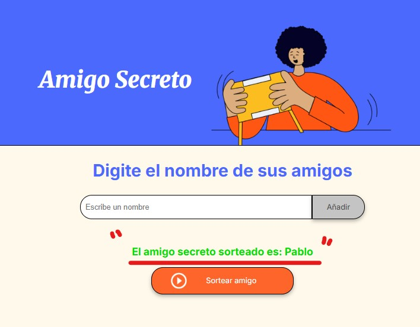

# Amigo_secreto
Esta es una aplicación sencilla y divertida que te permite organizar un sorteo de amigo secreto de forma digital, agregando participantes y eligiendo al ganador aleatoriamente.

✅ Funcionalidades
Agregar nombres:
Ingresa nombres de participantes a través de un campo de texto y añádelos a una lista dinámica.

Visualizar lista:
Los nombres ingresados aparecen en una lista que puedes revisar antes de realizar el sorteo.

Realizar sorteo aleatorio:
Al presionar el botón "Sortear amigo", el sistema selecciona un nombre aleatoriamente y lo muestra como ganador.

Reiniciar automáticamente:
Una vez realizado el sorteo, la lista se limpia para comenzar un nuevo sorteo si lo deseas.

📸 Capturas de pantalla

1️⃣ Agregar nombres

2️⃣ Lista de nombres antes del sorteo

3️⃣ Resultado del sorteo

🛠 Tecnologías utilizadas
HTML5
CSS3
JavaScript (Vanilla JS)
🤝 Contribuciones
¡Las contribuciones son bienvenidas! Si deseas mejorar la app o añadir nuevas funcionalidades, no dudes en hacer un pull request.

📄 Licencia
Este proyecto está bajo la licencia MIT.
